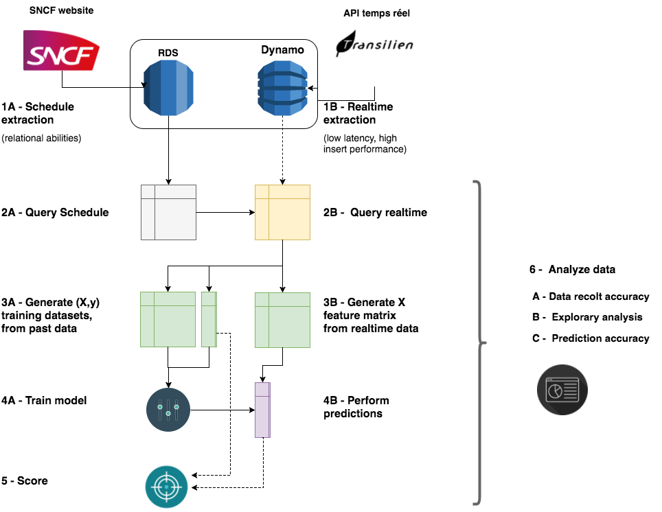

# API TRANSILIEN

## Overview

This repository is part of a broader project with SNCF’s R&D department to provide arrival time predictions for trains in Paris area.

A repository details how this project is deployed through Vagrant and Salt automation tools.

Another details details how the website and the API built for this project work.

 



## Automated Jobs (scheduled in Celery app)

### Extraction process
**Every week: scheduled departure times (from SNCF website in GTFS format):**

- download schedules from SNCF website (csv format)
- save it in S3 bucket
- save it in relational database (optionally)

**Every minute: real departure times (from Transilien’s API)**

- extract real departure times from transilien’s api
- save it in Dynamo ‘real_departures’ table

### Machine learning process

**Every day: feature matrix of day before**
- build feature matrix of day before
- save it in S3 bucket

**Every week: retrain model for each line**
- download feature matrices from S3
- train models on lines
- save prediction pipeline in RDS

## On demand computations (served through API)

### Build feature vectors in real-time
- compute all necessary features from schedule and realtime data

### Compute prediction
- download last trained prediction pipeline in RDS for that line
- use it to compute prediction for given feature vectors


## Getting started

There are two main methods: either you set up your working environment manually on your machine, or you can
use a solution to deploy it on AWS.

### Manual method

Clone repository:
```
git clone https://github.com/leonardbinet/Transilien-Api-ETL.git
```

Then create virtual env:
```
conda create -n api_transilien python=3
source activate api_transilien
pip install -r requirements/prod.txt
# because of pull-request not yet accepted for bug correction:
pip install -e git+git://github.com/leonardbinet/PynamoDB.git@master#egg=pynamodb
```

Then setup secret file `secret.json`:
```
{
    "AWS_ACCESS_KEY_ID":"***",
    "AWS_SECRET_ACCESS_KEY":"***",
    "AWS_DEFAULT_REGION":"eu-west-1",

    "RDB_TYPE": "****",
    "RDB_USER": "****",
    "RDB_DB_NAME": "****",
    "RDB_PASSWORD":"****",
    "RDB_HOST":"****",
    "RDB_PORT":"****",

    "MONGO_HOST":"****",
    "MONGO_USER":"****",
    "MONGO_DB_NAME":"****",
    "MONGO_PASSWORD":"****"
}
```

Then either create cron job, or set celery app.

### Automated service on AWS

This [repository](https://github.com/leonardbinet/Salt-Vagrant-master-mode) provides a method to set up two machine on AWS:
  - one having all scheduled jobs running
  - one machine serving the API and computing on-demand services 

It makes use of Vagrant and SaltStack to deploy and configure thoses machines.

## Documentation

You will find detailed documentation here.
[HERE](https://leonardbinet.github.io/)

### Generate documentation
To generate documentation:

First activate your virtualenv (you should have Sphinx and sphinx_rtd_theme installed), from root directory:
```
# create structure
sphinx-apidoc --separate -f -o docs api_etl

# generate html
cd docs
make html
```
You will find documentation in `docs/_build` directory

*Warning*: beware of secrets. If your secrets are set in the secret.json file, they might be exposed through `get_secret` function parameters in documentation.
